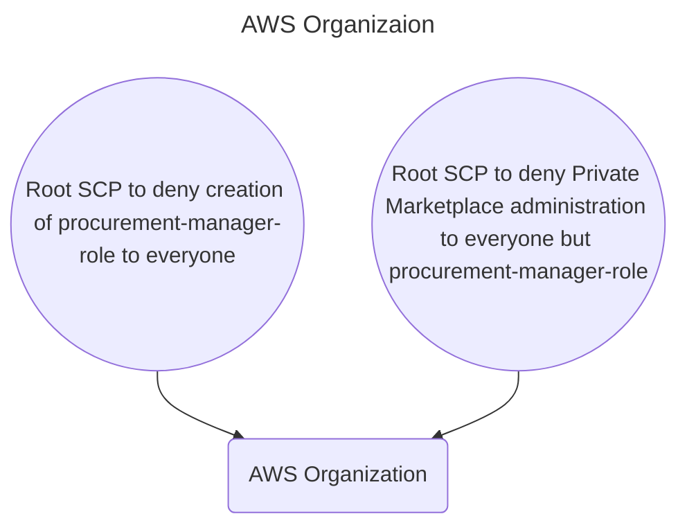
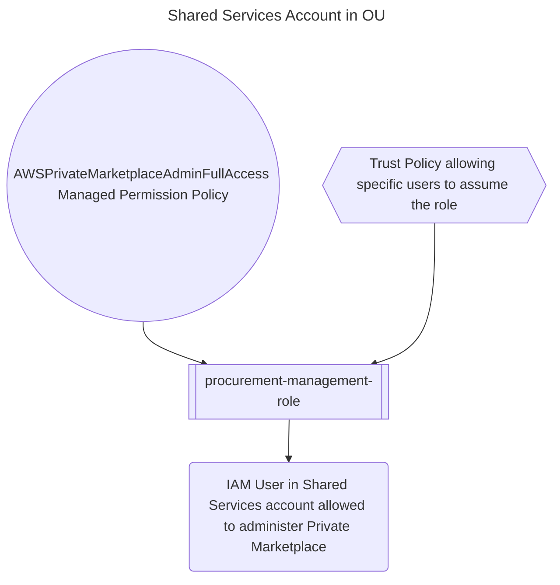

# AWS Organizations and Private Marketplace

AWS Provides a `Private Marketplace`
to create a curated catalog of `Public Marketplace` offerings available only to your `AWS Organization`.

`Private Marketplace` can be instantiated in a **management** account of the `AWS Organization`.

## Here is _best practice approach_ to administering `Private Marketplace`.

Typical `AWS Organization` contains multiple `OU`s _each with multiple accounts_.

In **each** `OU`, there is an account nominated to be a **Shared Services Account** 
serving a special purpose of hosting common resources for all other accounts in the `OU`. 
(like a Git server that all accounts in the OU are using)

1. Create an IAM role named `procurement-manager-role` in **each** of the _Shared Services Accounts_.
2. Add the [`AWSPrivateMarketplaceAdminFullAccess`](#awsprivatemarketplaceadminfullaccess-managed-permission-policy) managed policy to the role.
3. [Create an organization root-level SCP to deny permissions to administer `Private Marketplace` to everyone except `procurement-manager-role`](#scp-to-deny-permissions-to-administer-private-marketplace-to-everyone-except-the-procurement-manager-role)
4. [Create another organization root-level SCP to deny permissions to create the `procurement-manager-role` to everyone in the organization](#scp-to-deny-permission-to-create-the-procurement-manager-role-to-everyone-in-the-organization) 


```Mermaid
---
title: Management Account
---
flowchart TD
    private_marketplace("Private Marketplace Service")
```

## SCP to deny permissions to administer `Private Marketplace` to everyone except the `procurement-manager-role`
```JSON
{
   "Version": "2012-10-17",
   "Statement": [
      {
         "Sid": "ProcurementPolicy",
         "Effect": "Deny",
         "Action": [
            "aws-marketplace:CreatePrivateMarketplace",
            "aws-marketplace:StartPrivateMarketplace",
            "aws-marketplace:StopPrivateMarketplace",
            "aws-marketplace:DescribePrivateMarketplaceStatus",
            "aws-marketplace:AssociateProductsWithPrivateMarketplace",
            "aws-marketplace:DisassociateProductsFromPrivateMarketplace",
            "aws-marketplace:ListPrivateMarketplaceProducts",
            "aws-marketplace:DescribePrivateMarketplaceProducts",
            "aws-marketplace:ListPrivateMarketplaceRequests",
            "aws-marketplace:DescribePrivateMarketplaceRequests",
            "aws-marketplace:UpdatePrivateMarketplaceSettings",
            "aws-marketplace:DescribePrivateMarketplaceSettings",
            "aws-marketplace:CreatePrivateMarketplaceProfile",
            "aws-marketplace:UpdatePrivateMarketplaceProfile",
            "aws-marketplace:DescribePrivateMarketplaceProfile"
         ],
         "Resource": "*",
         "Condition": {
            "StringNotLike": {
               "aws:PrincipalARN": "arn:aws:iam::*:role/procurement-manager-role"
            }
         }
      }
   ]
}
```
## SCP to deny permission to create the `procurement-manager-role` to everyone in the organization
```JSON
{
    "Version": "2012-10-17",
    "Statement": [
        {
            "Sid": "DenyCreateProcurementManagerRole",
            "Effect": "Deny",
            "Action": [
                "iam:CreateRole",
                "iam:UpdateRole",
                "iam:PutRolePolicy",
                "iam:AttachRolePolicy"
            ],
            "Resource": "arn:aws:iam::*:role/procurement-manager-role"
        }
    ]
}

```
## A trust policy to allow procurement users in the shared services account to assume the `procurement-manager-role` 
```json
{
    "Version": "2012-10-17",
    "Statement": [
        {
            "Effect": "Allow",
            "Principal": {
                "AWS": [
                    "arn:aws:iam::<shared-services-account-id>:user/User1",
                    "arn:aws:iam::<shared-services-account-id>:user/User2",
                    "arn:aws:iam::<shared-services-account-id>:user/User3"
                ]
            },
            "Action": "sts:AssumeRole"
        }
    ]
}
```
## `AWSPrivateMarketplaceAdminFullAccess` Managed Permission Policy
```JSON
{
  "Version" : "2012-10-17",
  "Statement" : [
    {
      "Sid" : "PrivateMarketplaceRequestPermissions",
      "Effect" : "Allow",
      "Action" : [
        "aws-marketplace:AssociateProductsWithPrivateMarketplace",
        "aws-marketplace:DisassociateProductsFromPrivateMarketplace",
        "aws-marketplace:ListPrivateMarketplaceRequests",
        "aws-marketplace:DescribePrivateMarketplaceRequests"
      ],
      "Resource" : [
        "*"
      ]
    },
    {
      "Sid" : "PrivateMarketplaceCatalogAPIPermissions",
      "Effect" : "Allow",
      "Action" : [
        "aws-marketplace:ListEntities",
        "aws-marketplace:DescribeEntity",
        "aws-marketplace:StartChangeSet",
        "aws-marketplace:ListChangeSets",
        "aws-marketplace:DescribeChangeSet",
        "aws-marketplace:CancelChangeSet"
      ],
      "Resource" : "*"
    },
    {
      "Sid" : "PrivateMarketplaceCatalogTaggingPermissions",
      "Effect" : "Allow",
      "Action" : [
        "aws-marketplace:TagResource",
        "aws-marketplace:UntagResource",
        "aws-marketplace:ListTagsForResource"
      ],
      "Resource" : "arn:aws:aws-marketplace:*:*:AWSMarketplace/*"
    },
    {
      "Sid" : "PrivateMarketplaceOrganizationPermissions",
      "Effect" : "Allow",
      "Action" : [
        "organizations:DescribeOrganization",
        "organizations:DescribeOrganizationalUnit",
        "organizations:DescribeAccount",
        "organizations:ListRoots",
        "organizations:ListParents",
        "organizations:ListOrganizationalUnitsForParent",
        "organizations:ListAccountsForParent",
        "organizations:ListAccounts",
        "organizations:ListAWSServiceAccessForOrganization",
        "organizations:ListDelegatedAdministrators"
      ],
      "Resource" : "*"
    }
  ]
}
```