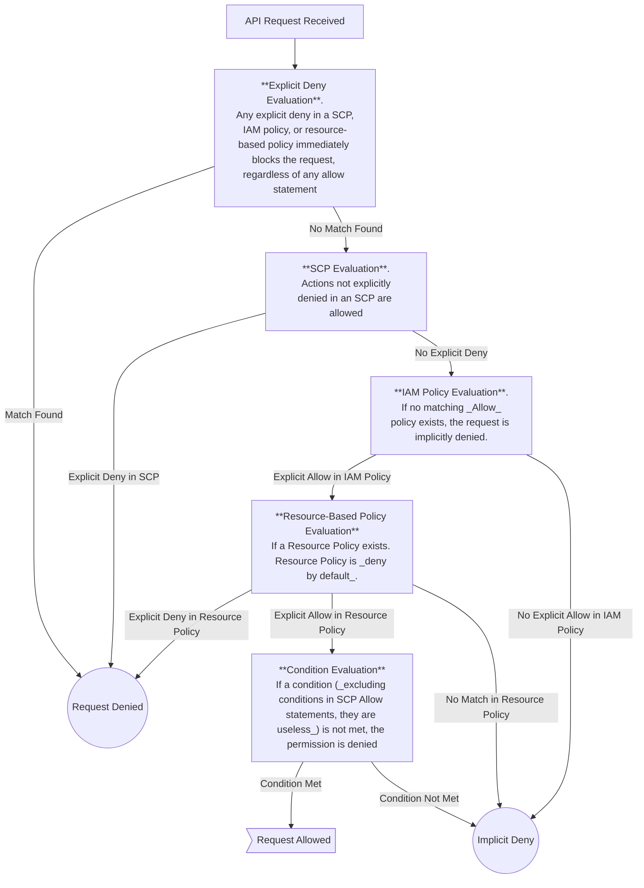

# AWS Permission Evaluation

```mermaid
flowchart TD
    A[API Request Received] --> B["**Explicit Deny Evaluation**.<br/> Any explicit deny in a SCP, IAM policy, or resource-based policy immediately blocks the request, regardless of any allow statement"]
    B -->|Match Found| C[Request Denied]
    B -->|No Match Found| D["**SCP Evaluation**.<br/> Actions not explicitly denied in an SCP are allowed"]
    D -->|Explicit Deny in SCP| C
    D -->|No Explicit Deny| E["**IAM Policy Evaluation**.<br/> If no matching _Allow_ policy exists, the request is implicitly denied."]
    E -->|Explicit Allow in IAM Policy| F["**Resource-Based Policy Evaluation**<br/>If a Resource Policy exists. Resource Policy is _deny by default_."]
    E -->|No Explicit Allow in IAM Policy| G[Implicit Deny]
    F -->|Explicit Deny in Resource Policy| C
    F -->|Explicit Allow in Resource Policy| H["**Condition Evaluation**<br/>If a condition (_excluding conditions in SCP Allow statements, they are useless_) is not met, the permission is denied"]
    F -->|No Match in Resource Policy| G
    H -->|Condition Met| I[Request Allowed]
    H -->|Condition Not Met| G

    G((Implicit Deny))
    C((Request Denied))
    I>Request Allowed]
```
> For a note on `Allow` statements in `SCP` and their conditions, see 
> 
{style="note"}