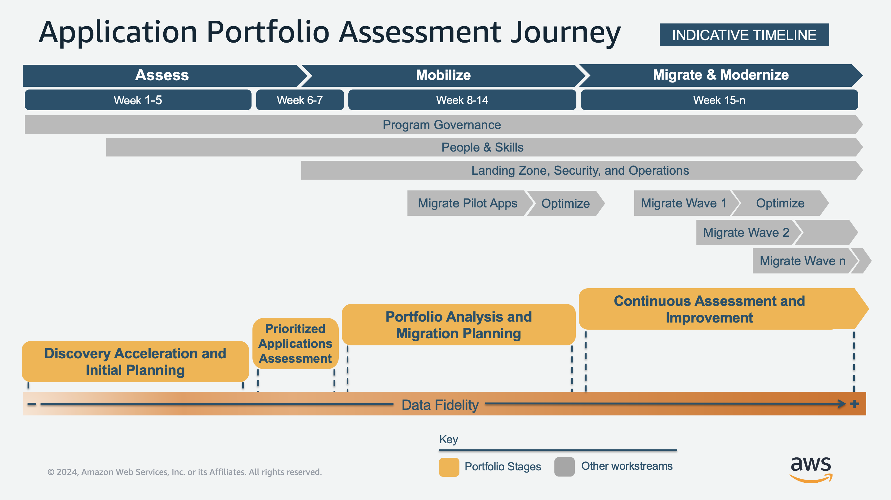

# Application Portfolio Assessment—AWS Cloud Migration

1. Portfolio discovery and initial planning
2. Prioritized applications assessment
3. Portfolio analysis and migration planning
4. Continuous assessment and improvement

 {thumbnail="true"}