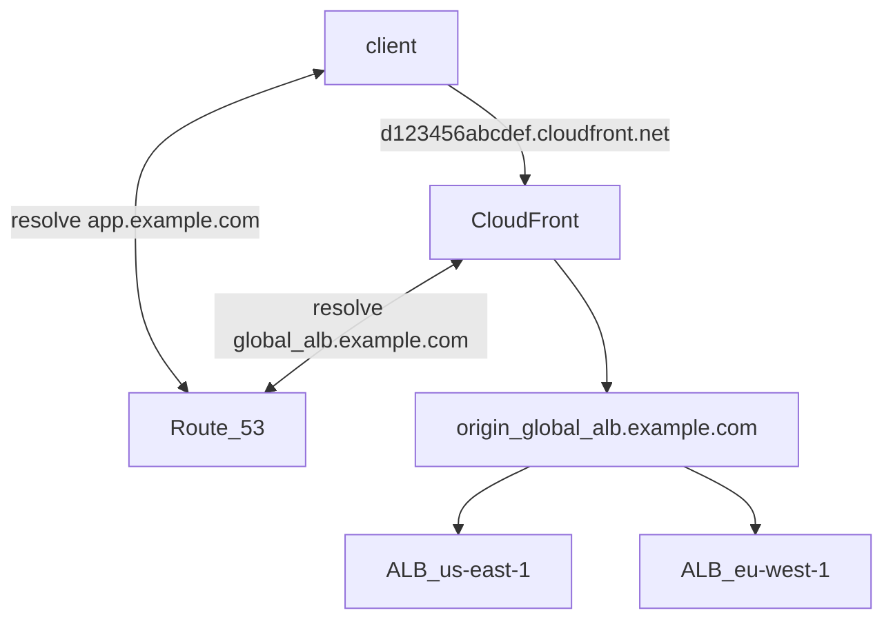

# CloudFront And Route53 Latency Routing

`CloudFront` and `Route53` `Latency Routing` can be used **together**, especially in **multi-region scenarios**.
## Basic Architecture
* Application is deployed in 2 regions – `us-east-1` and `eu-west-1`.
* Each region has an array of web servers behind an `ALB` serving the same content.
* `DynamoDB` stores user profile preferences.

Let us say we're serving this app from `app.example.com` domain name.

## Requirement
1. We need to provide **low-latency** access to **web content**
2. We need to provide **low-latency** access to **user profile data stored in DynamoDB**.

## Analysis
The first requirement means using `CloudFront`. But what about the second?

If a user requests data **not already in cache**, `CloudFront` will use the `Origin` to retrieve it.

Since we have the application deployed in two regions, we would like `CloudFront` to use the
`Origin` in the same region as requester to update its cache.
(which in turn guarantees that the `DynamoDB` from the same region is used as well)

In `CloudFront`, we can have two origins pointing to the same content in an`Origin Failover` configuration.

But in `Origin Failover` configuration the content is retrieved only from the primary origin unless it becomes unavailable. 
So that doesn't solve the problem of multiple origins working in parallel and also – what if we expand
and there are five regions instead of 2?

**What we need is an origin that resolves to the fastest region based on latency.**

Enter `Route53` `Latency Based Routing`

## Solution 

To make this work:
* We establish the`global_alb.example.com` domain with a valid `ACM` certificate. This domain name will serve as the `CloudFront` `Origin`.
* In `Route53`, we create a `DNS` record set for `global_alb.example.com` that has two `A` (alias) records with **routing policy set to latency** each pointing to the `ALB`s **in their corresponding region**.
* When configuring `CloudFront` distribution's **origin**, we use `global_alb.example.com`

Request flow for non-cached data:
* client wants to resolve `example.com`
* `Route53` responds with` d123456abcdef.cloudfront.net`
* client sends a request to `d123456abcdef.cloudfront.net`
* global `CloudFront` plane receives the request and forwards it to the nearest `CloudFront Edge Location` (POP, point of presence)
* `CloudFront` edge location makes a `DNS` request to route 53 to resolve the origin `global_alb.example.com`
* `Route53` using **latency-based routing** resolves to `ALB` `IP` for **the closest region**
* `CloudFront` forwards the request to origin