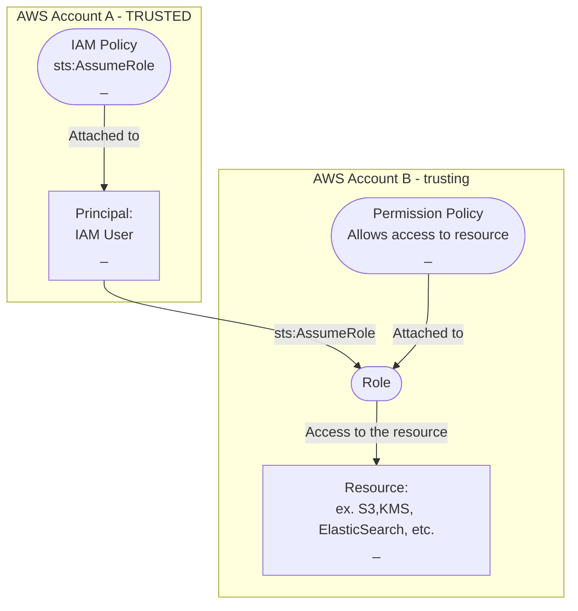

<show-structure depth="3"/>

# Cross-Account Access

Can be done using:
* resource-based policies (don't assume a role, **keep your permissions in the trusted account** when accessing the trusting account)
* identity-based policies (use `sts:AssumeRole`) (sometimes called user-based policy)
## Using resource-based policy


The principal in `AWS Account A` **doesn't give up their permissions** in the `AWS Account A`
while having access to the shared resource in the trusting `AWS Account B`.

This is useful for tasks such as copying information to or from the shared resource in the other account.

>Only certain resources support resource-based policies: [](AWS-Services-That-Support-Resource-Policies.md)
### Example resource-based policies for KMS
#### Account B (with resource)
KMS Key **Policy in B** attached to a Key (resource)
```json
{
  "Version": "2012-10-17",
  "Id": "key-policy-example",
  "Statement": [
    {
      "Sid": "Allow Account A to use this key",
      "Effect": "Allow",
      "Principal": {
        "AWS": "arn:aws:iam::AccountA-ID:user/Username"
      },
      "Action": [
        "kms:Decrypt",
        "kms:DescribeKey"
      ],
      "Resource": "*"
    }
  ]
}
```
{type="medium"}
`AccountA-ID`
: AWS account ID for Account A

`Username`
: User in Account A

`"Resource": "*"`
: NOTE that `Resource` is set to `*`.
For a resource-based policy, it is intended to mean _this resource_.
This policy attached to a **specific resource** (a specific KMS key in this case), 
so technically it doesn't need a `Resource` designator.
It can be omitted, however,
it is considered good practice to mention `"Resource": "*"` in resource-based policies for consistency. 

#### Account A (with IAM user accessing resource in B)
IAM **Policy in A** attached to an IAM User in A
```json
{
  "Version": "2012-10-17",
  "Statement": [
    {
      "Effect": "Allow",
      "Action": [
        "kms:Decrypt",
        "kms:DescribeKey"
      ],
      "Resource": "arn:aws:kms:region-B:AccountB-ID:key/KeyID"
    }
  ]
}
```
> NOTE that `Action` lists in A and B policies don't have to match.
> 
> HOWEVER, ONLY the actions present in BOTH policies will succeed
>
{style="note"}

### Example resource-based policies for S3
#### Account B (with S3 resource)
S3 bucket **Policy in B** attached to an S3 bucket (resource)
```json
{
  "Version": "2012-10-17",
  "Statement": [
    {
      "Effect": "Allow",
      "Principal": {
        "AWS": "arn:aws:iam::AccountA-ID:user/Username"
      },
      "Action": [
        "s3:GetObject",
        "s3:PutObject"
      ],
      "Resource": "arn:aws:s3:::example-bucket/*"
    }
  ]
}
```
> NOTE the S3 bucket ARN `arn:aws:s3:::example-bucket/*` with `:::` two omitted designators. See [](ARN-Components.md)
#### Account A (with IAM user accessing S3 bucket in B)
IAM **Policy in A** attached to an IAM User in A
```json
{
  "Version": "2012-10-17",
  "Statement": [
    {
      "Effect": "Allow",
      "Action": [
        "s3:GetObject",
        "s3:PutObject"
      ],
      "Resource": "arn:aws:s3:::example-bucket/*"
    }
  ]
}
```
## Using Identity-based Policy

With this method an IAM user in `Account A` **assumes a role** in `Account B`.

This creates a `Session` during which IAM User in `Account A` has only the permissions defined by the assumed role.

User's original IAM permissions in `Account A` are effectively given up for the duration of the `Session`.

