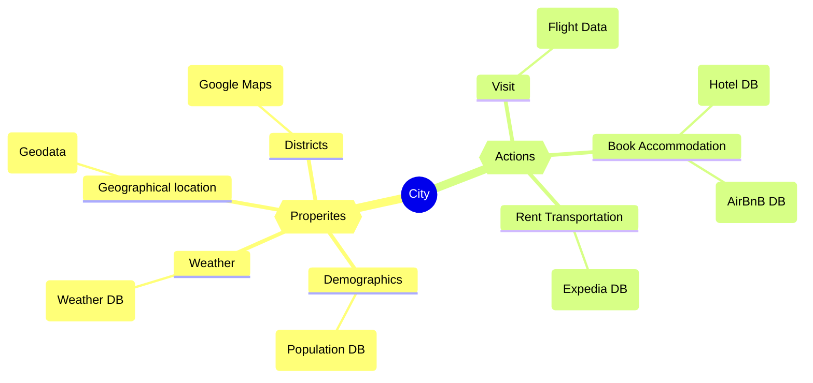

# Data Analytics

## Data Ontology
Data ontology is a way of linking data in various formats based on various concepts.

For example, if you search for “London,” the search engine knows that it is a **city** and what a city is.

The search engine will then retrieve data **points related to cities**, like demographics, districts, and so on.
It will then show the **travel options** that bring you to this city because your **relationship** to London might be **wanting to visit**.

So here we link the city object to its properties and possible actions.

A City object can have the following properties:
* demographics
* districts
* elevation
* weather

The city object can have the following actions:
* visit
* book hotel
* rent a car

## Master Data and Reference Data

### Reference data
Reference data is a subset of master data.

Used for categorizing master data. Can also relate to information outside your business.

Examples of reference data:
* customer segments
* business processes
* countries
* zip codes

### Master Data
Data generated by your business that is being analyzed.
Examples of master data:
* Customer
  * customer profiles
  * where they shop
  * how they buy
  * what they buy
* Financial
  * asset management policies
  * accounting groups
  * financial regulations
* Governance
* Location 
* Employee
* Product

## Data Preparation Tools
* Databricks
* Denodo
* Tableau
* Alteryx
* PowerBI

## Row and Column Level Security
Row-Level Security (RLS) and Column-Level Security (CLS) impose data access restrictions.
* CLS allows for specific users to access only certain **columns** of a table
* RLS restricts users from accessing only data **rows** pertinent to their role
