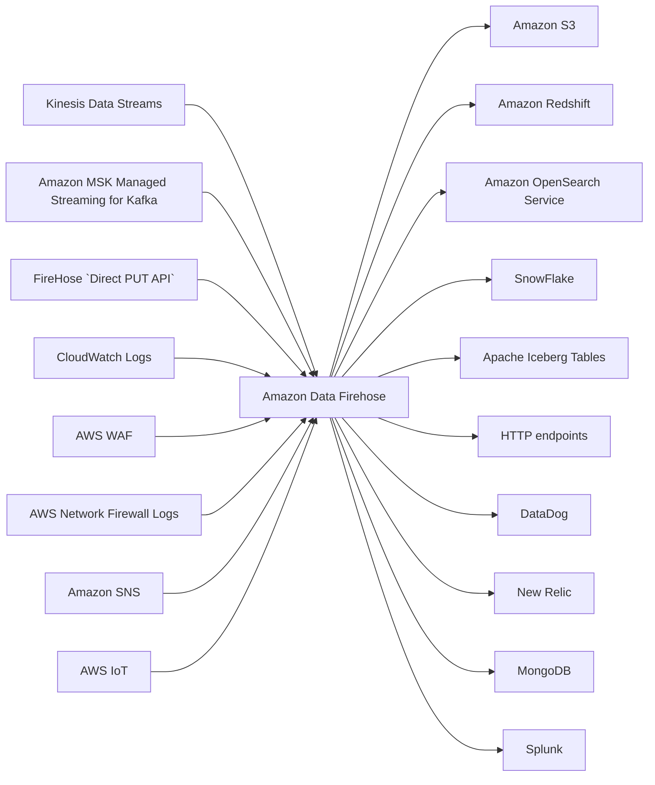

# Data Firehose

Amazon Data Firehose (former Kinesis Data Firehose) is an **ETL Service** for ingesting and delivering large volumes of data.
**Doesn't store the data it is processing**

## Sources and Destinations

## Save Kinesis Streams Data to S3

`Kinesis Data Streams` can be saved to `S3` for backup and archiving purposes using `Data Firehose` with a **Delivery Stream**

 {thumbnail="true"}

Alternatively, you can use a *Consumer* which is an `Amazon Kinesis Data Streams Application` that you develop to 
read data from the streams and output to a specific destination.

One of those consumers is [`Amazon Kinesis S3 Connector`](https://github.com/amazon-archives/amazon-kinesis-connectors?tab=readme-ov-file) 

 {thumbnail="true"}

## High-Level Architecture of Kinesis _Data Streams_

`Data Streams` is for **real-time** and is capable of employing complex data processing logic.

**Stores data in a stream for a set period of time**

{thumbnail="true"}