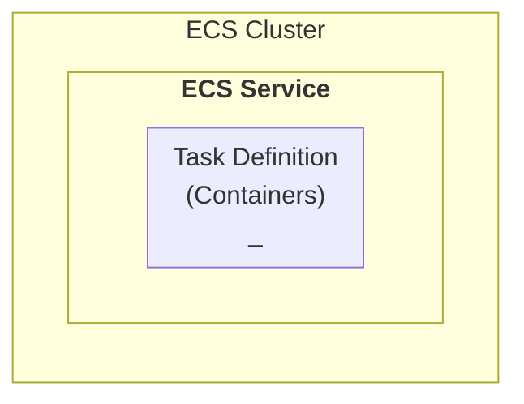

# ECS Service Definition

ECS Cluster is defined by an `ECS Service`.

## ECS service description

| Parameter                 | Description                                         |
|---------------------------|-----------------------------------------------------|
| Desired Count             | Number of Tasks to launch                           |
| Load Balancer Integration | ARN of the Target Group of the load balancer to use |
| Auto Scaling              | Auto Scaling strategy                               |
|                           |                                                     |