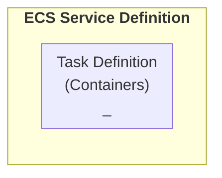
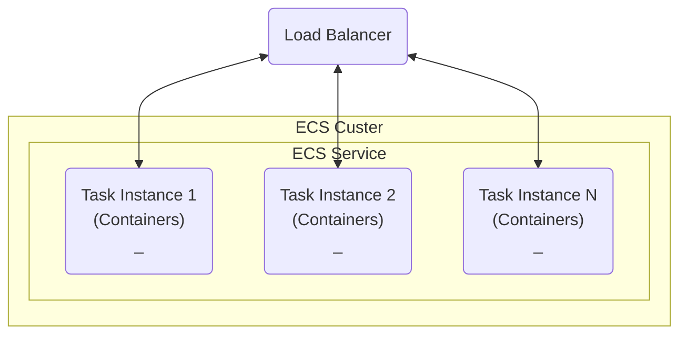

# ECS Service Definition

ECS Cluster is defined by an `ECS Service`.

## ECS service description

> Note that `Netowrk Configuration` and `Launch Type` parameters exist in BOTH `ECS Service Definition` and `Task Definition`
> 
> `Task Definition` defines **what values are possible** for a task
> 
> `ECS Service Definition` defines the actual values that will be used when the cluster is launched, **provided** those runtime values are one of the values specified in the task definition.
> 
> EX. If the Task Definition contains `Network Mode: awvsvpc | direct,` then the ECS Service Definition can be created to launch a cluster with either type of network connectivity.
{style="note"}

| Parameter                 | Description                                                                                                      |
|---------------------------|------------------------------------------------------------------------------------------------------------------|
| Desired Count             | Number of Task Instances to launch                                                                               |
| Load Balancer Integration | ARN of the Target Group of the load balancer to use                                                              |
| Auto Scaling              | Auto Scaling policy to apply                                                                                     |
| Task Definition           | The name of your [Task Definition](ECS-Task-Definitions.md)                                                      |
| Launch Type               | `EC2` or `FARGATE`                                                                                               |
| Network Configuration     | Specifies the VPC subnets, security groups, and other network settings **when using the `awsvpc` network mode**. |
| Health Checks             | Set up health checks so ECS can replace unhealthy tasks automatically.                                           |
