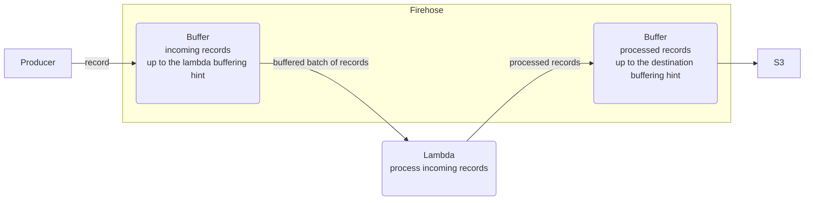

# Firehose Data Transformation


1. producer sends a `record` or a `record batch` to firehose.
2. firehose buffers the incoming records up to the `lambda buffering hint`
3. once the `lambda buffering hint` is reached, the incoming records are sent to lambda for processing
4. the lambda returns processed records to firehose
5. firehose places processed records into its destination buffer
6. once the `destination buffering hint` is reached, firehose dumps processed records to destination

> `lambda` is invoked in parallel for each buffered record batch as soon as the batch's `lambda buffering hint` is reached

> firehose uses `synchronous` lambda invocation mode

## Definitions

lambda buffering hint (incoming buffer)
: a tuple of (`size`, `time`) where `size` is max buffer size in `MB` and `time` is max buffering time in `sec`
: range (`[0.2-3 MB]`, `[0-900 sec]`)
: default (`1 MB`, `60 sec`)
: once *either* `size` or `time` limit is reached, Firehose sends buffer content to `lambda` for processing

destination buffering hint (outgoing buffer)
: a tuple of (`size`, `time`) where `size` is max buffer size in `MB` and `time` is max buffering time in `sec`
: range (`[1-128 MB]`, `[0-900 sec]`)
: default (`5 MB`, `300 sec`)

record
: a firehose record submitted by producer
: API: `PutRecord` or `PutRecordBatch`
: Limits:
Each delivery stream can take in up to 2,000 transactions per second, 5,000 records per second, or 5 MB per second.
`PutRecordBatch` request supports up to 500 records.
Each record in the request can be as large as 1,000 KB (before base64 encoding),
up to a limit of 4 MB for the entire request
: `PutRecord` structure
```json
{
  "DeliveryStreamName": "string",
  "Record": {
    "Data": blob
  }
}
```
: `PutRecordBatch` structure
```json
{
   "DeliveryStreamName": "string",
   "Records": [ 
      { 
         "Data": blob
      }
   ]
}
```