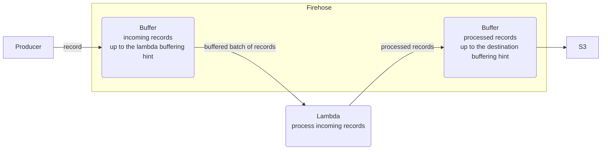

# Firehose Data Transformation

1. producer sends the record or a record batch to firehose.
2. firehose buffers the incoming records up to lambda buffering hint
3. once lambda buffering hint is reached, the incoming records are sent to lambda for processing
4. the lambda returns processed records to firehose
5. firehose places processed records into its destination buffer
6. once the destination buffer hint is reached, firehose dumps processed records to destination

## Definitions

record
: a firehose record submitted by producer 
API: `PutRecord` or `PutRecordBatch` 
Limits:
each delivery stream can take in up to 2,000 transactions per second, 5,000 records per second, or 5 MB per second
PutRecordBatch request supports up to 500 records. Each record in the request can be as large as 1,000 KB (before base64 encoding), up to a limit of 4 MB for the entire request
Second Term
: This is the definition of the second term.