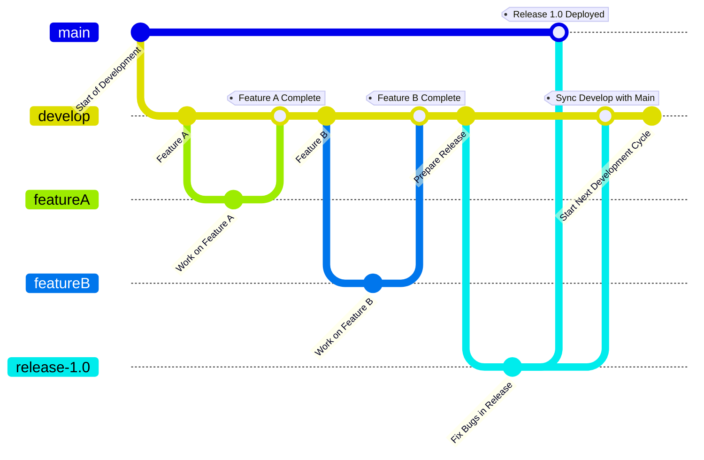
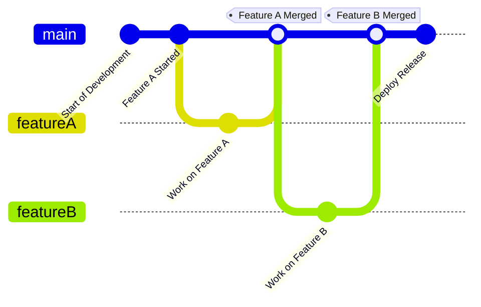

# Git Flows

| **Strategy**                | **Key Branches**                                     | **Release Branch**  | **Branch Purpose**                                                                                                                                                                                                                                                                            | **Advantages**                                                                                                                 | **Disadvantages**                                                                                     | **Use Case**                                                                        |
|-----------------------------|------------------------------------------------------|---------------------|-----------------------------------------------------------------------------------------------------------------------------------------------------------------------------------------------------------------------------------------------------------------------------------------------|--------------------------------------------------------------------------------------------------------------------------------|-------------------------------------------------------------------------------------------------------|-------------------------------------------------------------------------------------|
| **Git Flow**                | `main`, `develop`, `feature`, `release`, `hotfix`    | `release`           | - **`main`**: Stable production-ready code.   - **`develop`**: Integration branch for all changes.   - **`feature`**: Individual features or tasks.   - **`release`**: Final testing and bug fixes for an upcoming release.   - **`hotfix`**: Emergency fixes for production. | - Structured and organized.   - Isolates feature, release, and hotfix development.   - Ideal for teams with formal QA. | - Overhead with long-lived branches.   - Complex workflows not ideal for small teams or projects. | Complex projects with well-defined release cycles.                                  |
| **GitHub Flow**             | `main`, `feature`                                    | `main`              | - **`main`**: Single branch with production-ready code.   - **`feature`**: Short-lived branches for changes or tasks.                                                                                                                                                                     | - Simple and lightweight.   - Focuses on rapid development.   - Easy for smaller teams.                                | - Limited formal structure for releases.   - Not suitable for managing parallel releases.         | Continuous integration and delivery in small-to-medium projects.                    |
| **GitLab Flow**             | `main`, `staging`, `production`, `feature`           | `production`        | - **`main`**: General branch for integration and changes.   - **`staging`**: Code awaiting final testing before production.   - **`production`**: Live production code.   - **`feature`**: Individual changes or features.                                                        | - Aligns with DevOps workflows.   - Supports environment-specific deployments.                                             | - Environment-based branches may require custom workflows for complex systems.                        | Projects requiring environment-based workflows and CI/CD integration.               |
| **Trunk-Based Development** | `main` or `trunk`, short-lived branches              | `main`              | - **`main`/`trunk`**: Single branch for active development and production-ready code.   - **Short-lived branches**: Temporary branches for small tasks.                                                                                                                                   | - Simplifies branching.   - Encourages rapid delivery and tight feedback loops.   - Fewer merge conflicts.             | - Requires robust CI/CD pipelines and strict developer discipline.                                    | Fast-moving projects prioritizing frequent small deployments.                       |
| **Feature Branching**       | `main` or `develop`, `feature` branches              | `main` or `develop` | - **`main`/`develop`**: Integration branches for finalized or ongoing development.   - **`feature`**: Task-specific or feature-specific branches.                                                                                                                                         | - Clear separation of work by feature.   - Individual branches for specific tasks.                                         | - Long-lived feature branches may lead to merge conflicts and integration delays.                     | Teams working on independent, modular tasks or features.                            |
| **Release Branching**       | `release-vX.Y`, `feature`, `hotfix`                  | `release-vX.Y`      | - **`release-vX.Y`**: Stable release branch for a specific version.   - **`feature`**: Individual task-specific branches.   - **`hotfix`**: Emergency patches for production versions.                                                                                                | - Simplifies management of multiple releases.   - Clear isolation of release-specific changes.                             | - Higher branch management overhead.   - Repetitive work for fixes across multiple branches.      | Projects with versioned deliverables or multiple supported versions.                |
| **Sequential Release**      | `release-X`, `feature-issue`, new branch per release | `release-X`         | - **`release-X`**: The main branch for development and eventual deployment of the release.   - **`feature-issue`**: Short-lived branches tied to individual tasks (e.g., JIRA items).                                                                                                     | - Predictable workflow.   - Isolated development per release.   - Natural continuity across releases.                  | - Merge conflicts for fixes applied across releases.   - Propagation of technical debt.           | Projects with linear, sequential releases needing clear isolation between versions. |

## Git Flow

## GitHub Flow

