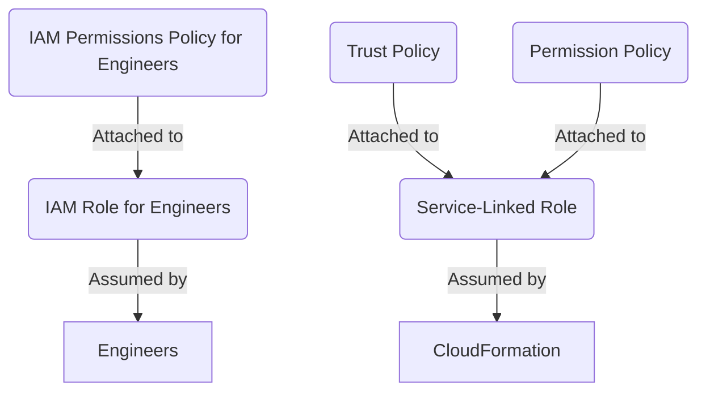

# IAM CloudFormation Roles

## Scenario
Restrict `Engineers` to create **ONLY approved resources** using `CloudFormation`.

`Service-Linked Role` restricts `CloudFormation` to create only approved resources.

Engineers' `IAM Role` restricts `Engineers` to only perform allowed `CloudFormation` actions
using only specified `Service-Linked Role`.

## Role Setup
* `IAM Role` assigned to `Engineers`
* `Permission Policy` attached to the `Engineers IAM Role` allowing only `CloudFormation` actions
* `Service-Linked Role` to be assumed by `CloudFormation` when creating a stack
* `Trust Policy` attached to `CloudFormation` `Service-Linked Role` allowing `CloudFormation` to assume the `Service-Linked Role`
* `Permission Policy` attached to `CloudFormation` `Service-Linked Role` allowing creation of ONLY approved resources.



## Service-Linked Role `CloudFormationServiceRole`
### Permission Policy CloudFormation
```json
{
  "Version": "2012-10-17",
  "Statement": [
    {
      "Sid": "AllowApprovedResources",
      "Effect": "Allow",
      "Action": [
        "ec2:RunInstances",
        "ec2:CreateTags",
        "s3:CreateBucket",
        "s3:PutBucketPolicy"
      ],
      "Resource": [
        "arn:aws:ec2:us-east-1:123456789012:instance/*",
        "arn:aws:s3:::approved-bucket-prefix-*"
      ],
      "Condition": {
        "StringEquals": {
          "aws:RequestTag/Approved": "true"
        }
      }
    },
    {
      "Sid": "DenyUnapprovedActions",
      "Effect": "Deny",
      "Action": [
        "ec2:RunInstances",
        "s3:CreateBucket"
      ],
      "Resource": "*",
      "Condition": {
        "StringNotEquals": {
          "aws:RequestTag/Approved": "true"
        }
      }
    }
  ]
}
```
### Trust Policy CloudFormation
```JSON
{
  "Version": "2012-10-17",
  "Statement": [
    {
      "Effect": "Allow",
      "Principal": {
        "Service": "cloudformation.amazonaws.com"
      },
      "Action": "sts:AssumeRole"
    }
  ]
}
```

## Engineers IAM Role
## Permission Policy Engineers
```JSON
{
  "Version": "2012-10-17",
  "Statement": [
    {
      "Sid": "AllowCloudFormationActions",
      "Effect": "Allow",
      "Action": [
        "cloudformation:CreateStack",
        "cloudformation:UpdateStack",
        "cloudformation:DescribeStacks",
        "cloudformation:DeleteStack"
      ],
      "Resource": "arn:aws:cloudformation:*:*:stack/*"
    },
    {
      "Sid": "DenyDirectResourceProvisioning",
      "Effect": "Deny",
      "Action": [
        "ec2:RunInstances",
        "s3:CreateBucket",
        "rds:CreateDBInstance",
        "dynamodb:CreateTable"
      ],
      "Resource": "*"
    },
    {
      "Sid": "AllowServiceRolePass",
      "Effect": "Allow",
      "Action": "iam:PassRole",
      "Resource": "arn:aws:iam::*:role/CloudFormationServiceRole"
    }
  ]
}
```
> NOTE the last statement in the array of statements:
> 
> `"Resource": "arn:aws:iam::*:role/CloudFormationServiceRole"`
> 
> This restricts the `Engineers` to select ONLY specific `Service-Linked Role`
> when performing `CloudFormation` actions.
> 
{style="note"}

## Apply Configuration
```bash
aws cloudformation create-stack \
    --stack-name my-stack \
    --template-body file://template.json \
    --role-arn arn:aws:iam::123456789012:role/CloudFormationServiceRole
```