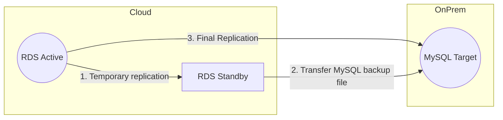

# RDS MySQL Add On-Prem Replica

AWS RDS can't add an on-prem replica directly. 
* Create a DB user to be used for replication to on-prem
* Create RDS Read Replica in AWS
* Confirm that replication is up to date on Replica
* Stop replication 
* Use `mysqldump` on Replica to dump the database
* Transfer the backup file to on-prem MySQL
* Restore the backup on the on-prem MySQL
* Stop on-prem MySQL
* Modify `my.cnf` file with server ID and database you will be replicating
* Start on-prem MySQL
* Change on-prem MySQL master to point to RDS Master


| Server         | Purpose                                                                                 |
|----------------|-----------------------------------------------------------------------------------------|
| `RDS-Active`   | Primary RDS in cloud to be replicated on prem                                           |
| `RDS-Standby`  | Temporary Read Replica in cloud to obtain db backup, transaction log and position files |
| `MySQL-Target` | Replication Target on prem                                                              |

1.  `AWS Console :` Confirm automated backups are on for `RDS-Active`
2.  `AWS Console :` Create an `RDS-Standby` read replica in cloud
3. `Using Linux Host`: Log in to `RDS-Standby` and confirm that read replica is up to date
   * `RDS-Stadby mysql CLI :`
      ```SQL
      show slave status \G
      ```
     `seconds_behind_master` in response should be `0`—replica is all caught up
4.  `RDS-Stadby mysql CLI :` stop replication
     ```SQL
     call mysql.rds_stop_replication;
     ```
5.  `RDS-Stadby mysql CLI :` record latest log filename and position in the log file
     ```SQL
     show slave status \G
     ```
    * note the value of `Relay_Master_Log_File` (Will be something like `mysql-bin.000004`)
    * note the value of `Exec_Master_Log_Pos` (Will be something like `931`)
6.  `Using Linux Host :` Use `mysqldump` to create a backup of `RDS-Standby`
     ```SQL
     mysqldump -h {hostname} -u {username} -p {dbname} > {backup_file_name}.sql
     ```
7.  `MySQL-Target :` create new database `{dbname}`
8.  Transfer `{backup_file_name}.sql` to `MySQL-Target`
9.  `MySQL-Target :` Restore `{backup_file_name}.sql` into the new database
    ```SQL
    mysql -h {hostname} -u {username} -p {dbname} < {backup_file_name}.sql
    ```
10. `RDS-Active mysql CLI :` Set up replication user `{repl_user}` on `RDS-Active`and grant privileges
    ```SQL
    create user {repl_user}@'%' identified by '{repl_user}';
    ```
    ```SQL
    grant replication slave, replication client on *.* to {repl_user}@'%';
    ```
    ```SQL
    show grants for {repl_user}@'%';
    ```
11. `MySQL-Target :` Stop MySQL server

12. `MySQL-Target :`
    Modify the **`my.cnf` file** parameters to point to your unique server ID and the name of the database
    that you want to replicate from the DB instance. For example, `server_id=2` and `replicate-do-db=test`.
13. `MySQL-Target :` Start MySQL server
14. On `MySQL-Target mysql CLI :` establish connection to `RDS-Active`
    ```SQL
    change master to master_host='{rds-endpoint}',master_user='{repl_user}', master_password='{password}', master_log_file='mysql-bin.000004', master_log_pos= 931;
    ```
    `master_log_file` value is the value of `Relay_Master_Log_File` you noted in step 5  
    `master_log_pos` value is the value of `Exec_Master_Log_Pos` you noted in step 5

    `repl_user` is the user created in step 10
15. Confirm that `MySQL-Targe`t can connect to `RDS-Active`

16. `MySQL-Target mysql CLI`: start the replication
    ```SQL
    start slave;
    ```
17. `MySQL-Target :` Check that replication is working
    ```SQL
    show slave status \G
    ```
18. After `seconds_behind_master` in response is `0`, delete the temporary `RDS-Standby` instance.

REF: [How can I use binary logs from an Amazon RDS for MySQL active DB instance to replicate to an on-premises standby instance?](https://repost.aws/knowledge-center/replicate-amazon-rds-mysql-on-premises)