# Release Management

```mermaid
flowchart TB
    subgraph Documentation
        Documentation_Update("**Documentation Updates**<br/>Ensuring user manuals, API docs, and technical specs reflect the latest changes.")
        Retrospective("**Release Retrospective**<br/>Reviewing what went well, what didn’t, and lessons learned to improve future releases.")
        Documentation_Update --> Retrospective
    end
    subgraph Monitoring
        Monitoring_Post_Release("**Post-Release Monitoring**<br/>Using tools like logs, metrics, or monitoring dashboards to ensure the system operates as expected.")
        Incident_Management("**Incident Management**<br/>Quickly addressing any issues or bugs that arise after deployment.")
        Feedback_Collection("**Feedback Collection**<br/>Gathering input from users and stakeholders for future improvements.")
        Monitoring_Post_Release --> Incident_Management --> Feedback_Collection
    end
    subgraph Deploy
        Release_Notes("**Release Notes**<br/>Documenting features, fixes, and known issues in the release.")
        Staging("**Staging Environment**<br/>Deploying the release to a staging or pre-production environment for final validation.")
        Deployment_Strategy("**Deployment Strategy**<br/>Choosing a deployment method such as:<br/>* Blue-Green<br/>* Canary Release<br/>* Rolling Deployment")
        Change_Management("**Change Management**<br/>Communicating and documenting changes to minimize disruptions.")
        Release_Notes --> Staging --> Deployment_Strategy --> Change_Management
    end
    subgraph Test
        Unit_Test("**Unit Testing**<br/>Ensuring code behaves as expected at the module level.")
        Integration_Test("**Integration Testing**<br/>Verifying that different modules or components work together.")
        Regression_Test("**Regression Testing**<br/>Ensuring new changes don’t break existing functionality.")
        Performance_Test("**Performance Testing**<br/>Validating the system's performance under load.")
        UAT("**User Acceptance Testing (UAT)**<br/>Getting feedback from end users or stakeholders to ensure the release meets their expectations.")
        Unit_Test --> Integration_Test --> Regression_Test --> Performance_Test --> UAT
    end
    subgraph Build 
        Branching("**Branching Strategy**<br/>Using version control to manage release branches (e.g., GitFlow, GitHub Flow).")
        Build_Automation("**Build Automation**<br/>Automating the build process using CI/CD tools to ensure consistency and repeatability.")
        Dependencies("**Dependency Management**<br/>Ensuring all dependencies are up-to-date and compatible.")
        Branching --> Build_Automation --> Dependencies
    end
    subgraph Planning
        Scope("**Scope Definition**<br/>Identifying what features, fixes, or updates will be included in the release.")
        Schedule("**Release Calendar**<br/>Scheduling release dates, ensuring alignment with business needs and avoiding conflicts.")
        Stakeholders("**Stakeholder Engagement**<br/>Involving product managers, developers, QA teams, and operations to ensure alignment.")
        Risk_Assessment("**Risk Assessment**<br/>Identifying potential risks and creating mitigation strategies.")
        Scope --> Schedule --> Stakeholders --> Risk_Assessment
    end
    Risk_Assessment --> Branching
    Dependencies --> Unit_Test
    UAT --> Release_Notes
    Change_Management --> Monitoring_Post_Release
    Feedback_Collection --> Documentation_Update
```

## Issues and Resolutions
| **Conflict**                                  | **Resolution Strategies**                                                                                      |
|-----------------------------------------------|----------------------------------------------------------------------------------------------------------------|
| **Code Conflicts**                            | - **branching strategy** like GitFlow or GitHub Flow.                                                          |
|                                               | - **feature branches and pull requests (PRs)** with code reviews.                                              |
|                                               | - Run **automated tests** (unit, integration) on **every PR**.                                                 |
|                                               | - Implement a **code freeze** period before the release.                                                       |
|                                               | - Hold **conflict resolution meetings** to address dependencies and priorities.                                |
| **Environmental Conflicts**                   | - Use **Infrastructure as Code (IaC)** tools like Terraform or Ansible to standardize environments.            |
|                                               | - Docker or **Virtual Machines**.                                                                              |
|                                               | - Dedicated test environments for specific testing purposes (e.g., UAT, performance testing).                  |
| **Timeline and Scheduling Conflicts**         | - Maintain a centralized **release calendar** to track and plan releases.                                      |
|                                               | - **Break down features** into smaller, deliverable increments to reduce bottlenecks.                          |
|                                               | - Build **buffer time** into release schedules for unforeseen delays.                                          |
|                                               | - **Communicate** regularly with stakeholders to align priorities or adjust expectations.                      |
| **Communication and Collaboration Conflicts** | - Foster cross-functional collaboration using DevOps practices.                                                |
|                                               | - Create detailed and clear **release notes**.                                                                 |
|                                               | - Conduct daily **standups** or weekly meetings to ensure team alignment.                                      |
|                                               | - Use centralized tools like JIRA, Confluence, or Slack for communication and tracking.                        |
| **Testing and Quality Conflicts**             | - **Automate** repetitive **tests** (unit, integration, regression) to save time.                              |
|                                               | - Start testing early in the development process (shift-left testing).                                         |
|                                               | - Use mock services or **simulated environments** when live resources are unavailable.                         |
|                                               | - Define comprehensive **test plans** to ensure all scenarios are covered.                                     |
| **Deployment Conflicts**                      | - Minimize downtime using **deployment strategies like Blue-Green or Canary deployments**.                     |
|                                               | - Create **automated rollback processes** for quick recovery.                                                  |
|                                               | - Follow **semantic versioning** `<major>.<minor>.<patch>` and maintain clear versioning in release artifacts. |
|                                               | - **Standardize deployments using CI/CD pipelines** to reduce human error.                                     |
| **Post-Release Conflicts**                    | - Use **monitoring tools like New Relic**, Datadog, or CloudWatch to track system performance and issues.      |
|                                               | - Establish a clear **incident response plan** for triaging and resolving post-release issues.                 |
|                                               | - Collect user and **stakeholder feedback** for iterative improvements.                                        |
|                                               | - Set up a streamlined **process for deploying critical hotfixes**.                                            |

## On Track
* Set Expectations Early:
* Regular Status Updates
* Ownership via Collaboration Tools
* Intermediate deadlines
* Kanban Dashboard
* Risk Identification
* Buffer time
* Small wins

## Late feature
* understand delay (complexity, resource, external dependency)
* Can it be delayed? (must, should, could, won't haves)
* simplify or down to MVP
* if critical negotiate deadlines
* inform stakeholders on the decision, what is being done to mitigate
* potentially reallocate from less important features to this one

## Risks
* planning
  * define scope
  * define schedule
  * kickoff
* Testing
  * early testing
  * automated testing
  * load testing
  * staging environment
* Communication
  * slack
  * jira
* Dependencies
  * identify at kickoff
  * alternative to
* Last-minute changes
  * code freeze for non-critical
  * change control to assess and approve
* Deployment
  * CD automation
  * canary or rolling or blue-green
  * rollback procedure
* Security
  * secrets encrypted
  * SAST and DAST sonarqube or veracode
* Post-Release
  * monitoring
* Resources
  * resource allocation
  * cloud-based testing or vm testing

## KPI
* planned vs. actual release date
* scope change/creep in items
* lead change time – days from commit to deployment
* escapes
* regression rate % of defects introduced by new functionality
* test coverage
* `Mean time to recovery` after issue with deployment
* support tickets after release
* velocity
* burndown
