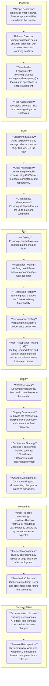

# Release Management

```mermaid
flowchart TB
    subgraph Documentation
        Documentation_Update("**Documentation Updates**<br/>Ensuring user manuals, API docs, and technical specs reflect the latest changes.")
        Retrospective("**Release Retrospective**<br/>Reviewing what went well, what didn’t, and lessons learned to improve future releases.")
        Documentation_Update --> Retrospective
    end
    subgraph Monitoring
        Monitoring_Post_Release("**Post-Release Monitoring**<br/>Using tools like logs, metrics, or monitoring dashboards to ensure the system operates as expected.")
        Incident_Management("**Incident Management**<br/>Quickly addressing any issues or bugs that arise after deployment.")
        Feedback_Collection("**Feedback Collection**<br/>Gathering input from users and stakeholders for future improvements.")
        Monitoring_Post_Release --> Incident_Management --> Feedback_Collection
    end
    subgraph Deploy
        Release_Notes("**Release Notes**<br/>Documenting features, fixes, and known issues in the release.")
        Staging("**Staging Environment**<br/>Deploying the release to a staging or pre-production environment for final validation.")
        Deployment_Strategy("**Deployment Strategy**<br/>Choosing a deployment method such as:<br/>* Blue-Green<br/>* Canary Release<br/>* Rolling Deployment")
        Change_Management("**Change Management**<br/>Communicating and documenting changes to minimize disruptions.")
        Release_Notes --> Staging --> Deployment_Strategy --> Change_Management
    end
    subgraph Test
        Unit_Test("**Unit Testing**<br/>Ensuring code behaves as expected at the module level.")
        Integration_Test("**Integration Testing**<br/>Verifying that different modules or components work together.")
        Regression_Test("**Regression Testing**<br/>Ensuring new changes don’t break existing functionality.")
        Performance_Test("**Performance Testing**<br/>Validating the system's performance under load.")
        UAT("**User Acceptance Testing (UAT)**<br/>Getting feedback from end users or stakeholders to ensure the release meets their expectations.")
        Unit_Test --> Integration_Test --> Regression_Test --> Performance_Test --> UAT
    end
    subgraph Build 
        Branching("**Branching Strategy**<br/>Using version control to manage release branches (e.g., GitFlow, GitHub Flow).")
        Build_Automation("**Build Automation**<br/>Automating the build process using CI/CD tools to ensure consistency and repeatability.")
        Dependencies("**Dependency Management**<br/>Ensuring all dependencies are up-to-date and compatible.")
        Branching --> Build_Automation --> Dependencies
    end
    subgraph Planning
        Scope("**Scope Definition**<br/>Identifying what features, fixes, or updates will be included in the release.")
        Schedule("**Release Calendar**<br/>Scheduling release dates, ensuring alignment with business needs and avoiding conflicts.")
        Stakeholders("**Stakeholder Engagement**<br/>Involving product managers, developers, QA teams, and operations to ensure alignment.")
        Risk_Assessment("**Risk Assessment**<br/>Identifying potential risks and creating mitigation strategies.")
        Scope --> Schedule --> Stakeholders --> Risk_Assessment
    end
    Risk_Assessment --> Branching
    Dependencies --> Unit_Test
    UAT --> Release_Notes
    Change_Management --> Monitoring_Post_Release
    Feedback_Collection --> Documentation_Update
```