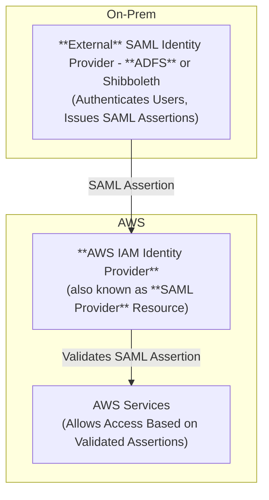

# SAML Identity Provider in IAM

## Scenario
You want to **establish trust between your external SAML-compatible IdP** (such as 
Shibboleth or Active Directory Federation Services) **and AWS**, 
so that **users in your organization authenticated by the external IdP can access AWS resources**.

> This is a prerequisite for both and 
> 
{style="note"}

> Take note in terminology specifics.
> * `LDAP` or `External IdP` – An entity that verifies a user's identity and provides authentication details to a service provider (like AWS) using a standard like SAML.
> * `AWS IAM IdP` – an AWS IAM object that represents the External Identity Provider (IdP) **within AWS**
> 
> `AWS IAM Identity Provider` object can be either a `SAML Provider` used here or `OpenID Connect (OIDC) Identity Provider`.

> Contrast using the `AWS IAM Identity Provider` approach with [Custom Identity Broker](Custom-Identity-Broker-Access-To-AWS.md) approach. 
> 
>`Custom Identity Broker` is **a broker you write yourself** and is primarily intended for **non-SAML** federated scenarios such as **Classic AD** (not ADFS).
> 
>Custom Identity Broker runs as an **IAM User** that is allowed to assume roles for federated users. It doesn't require an `AWS IAM IdP`.
{style="note"}

## Implementation

To configure IAM Identity Service based on external SAML-compatible IdP:

1. (_optional if using Classic AD_) configure Classic AD to work with SAML-compatible IdP such as ADFS (Active Directory Federation Services)
2. Get the SAML Metadata Document from `External SAML IdP` 
3. Create a `SAML Provider` Object in _AWS IAM Console_. The `SAML Provider` stores the SAML metadata document from the `External SAML IdP` 
4. Configure `External SAML IdP` with relying party trust (tell the `External SAML IdP` about AWS as a service provider)
5. In `External SAML IdP`, configure SAML assertions for the authentication response (configure attributes to be included in the SAML Assertion like `username`, `group`, roles the user is allowed to assume, and so on)

[Create a SAML identity provider in IAM](https://docs.aws.amazon.com/IAM/latest/UserGuide/id_roles_providers_create_saml.html)

[To determine what federated users can do in AWS, create an IAM role or roles.](IAM-Roles-For-SAML-Federation.md)