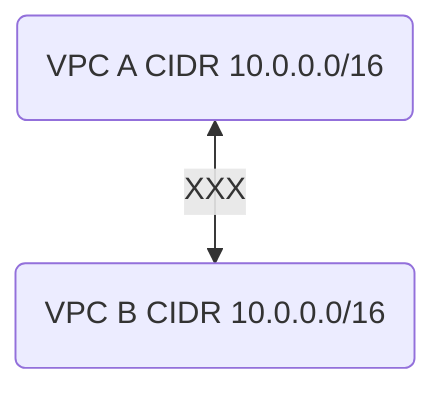
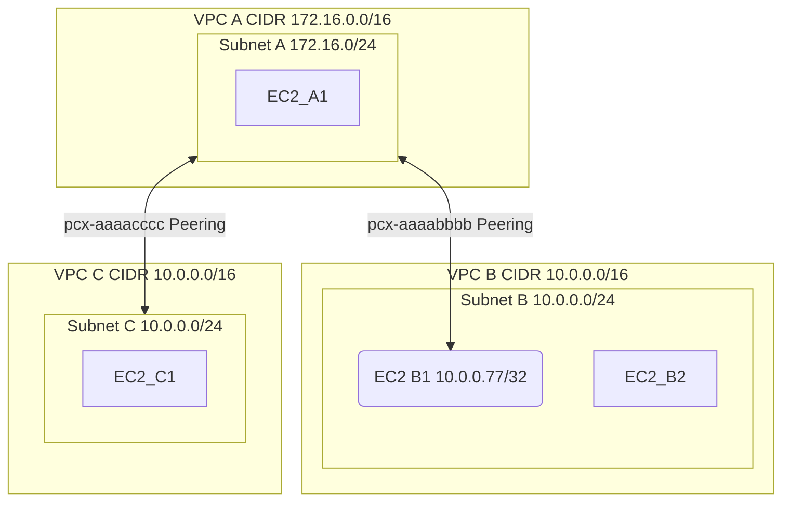

# VPC Peering Routing Overlapping Subnets

### Things to note first
* There is a difference between `VPC CIDR` and `Subnet CIDR`.   VPC CIDRis the whole block if IPs assigned to a VPC like `10.0.0.0/16` while subnet is a subset of the VPC CIDR like `10.0.1.0/24`
* Route tables in AWS are associated with subnets.   A subnet may or may NOT be explicitly associated with a route table.   Each VPC has a default `Main Route Table`. Any subnet not explicitly associated with a specific route table will use the `Main Route Table`
* A route table **cannot** contain 2 entries with the same `Destination` (ex `10.0.0.0/16`) but different `Target` (ex. one for `pcx-aaaabbbb`, another for `pcx-aaaacccc`)

Longest prefix match is used to evaluate the route priority.

Let's say you have the following route table:

| Destination  | Target       | Longest prefix priority |
|--------------|--------------|-------------------------|
| 10.0.0.77/32 | pcx-aaaabbbb | 0 (highest)             |
| 10.0.0.0/24  | pcx-aaaacccc | 1                       |
| 10.0.0.0/16  | pcx-aaaadddd | 2                       |

When a packet is considered for routing it first will hit the most specific route of `10.0.0.77/32 | pcx-aaaabbbb`.
If packet matches (a single IP), it will be sent to the target of `pcx-aaaabbbb`.

The next to evaluate will be the `10.0.0.0/24  | pcx-aaaacccc` route. If the packet came from a host on a `10.0.0.0/24` subnet, it will be sent to `pcx-aaaacccc`

Finally, the least-specific prefix route `10.0.0.0/16  | pcx-aaaabbbb` will be acted upon. If the packet came from a host on a `10.0.1.0/16` network, it will be sent to `pcx-aaaadddd`. 

### DIRECT peering with overlapping VPC CIDRs NOT SUPPORTED
VPC Peering DOES NOT support **direct** peering VPCs with overlapping **CIDR** blocks.

### Peering of a CENTRAL VPC to VPCs with overlapping CIDRs is supported
Several VPCs with overlapping CIDRs CAN peer to a central VPC, provided the central VPC CIDR does not overlap any of its direct peers. 

#### Routing
Now really you should not do this,- meaning peering 2 VPCs with overlapping subnets to a 3rd one.

The _normal_ solution in this case is to use the distinct subnets within overlapping VPC CIDRs in each VPC.
For example for VPC_B use subnet `10.0.2.0/24` and for VPC_C use subnet `10.0.3.0/24`.
This would greatly simplify the routing configuration and eliminate a variety of return path issues.

BUT sometimes needs must. So how do we get out of the overlapping CIDR + overlapping subnet + peering situation? There are 2 ways.

First of all let's mention that in the situation presented, **using a network prefix**, you can only route back from VPC_A to **one** of the other 2 VPCs.
You'll see what I mean.

Routing to the remaining VPC will have to be done on the host-by-host basis, by creating `/32` routes to reach each specific host.

##### Solution 1 - Use a specific route to host

| Route Table | Destination      | Target         |
|-------------|------------------|----------------|
| `VPC A`     | `172.16.0.0./16` | `Local `       |
|             | `10.0.0.77/32`   | `pcx-aaaabbbb` |
|             | `10.0.0.0/16`    | `pcx-aaaacccc` |
| ----------  | ----------       | ----------     |
| `VPC B`     | `10.0.0.0/16`    | `Local `       |
|             | `172.16.0.0./16` | `pcx-aaaabbbb` |
| ----------  | ----------       | ----------     |
| `VPC C`     | `10.0.0.0/16`    | `Local `       |
|             | `172.16.0.0./16` | `pcx-aaaacccc` |

Concentrate on `VPC A` route table. What we are doing is sending ALL return traffic intended for `10.0.0.0/16` range to **VPC C** - `pcx-aaaacccc`.
The only **exception** is the `10.0.0.77/32` host in **VPC B** whose packets will be sent via `pcx-aaaabbbb` because it is the most specific route.

This effectively provides communication between **VPC A** and **VPC C** and ONE SINGLE HOST in VPC B. 

Note that the rest of the hosts in **VPC B** will NOT get the return traffic, the return traffic will go to **VPC C**.

##### Solution 2 - Route to only one of the VPCs

| Route Table | Destination      | Target         |
|-------------|------------------|----------------|
| `VPC A`     | `172.16.0.0./16` | `Local `       |
|             | `10.0.0.0/24`    | `pcx-aaaabbbb` |
|             | `10.0.0.0/16`    | `pcx-aaaacccc` |
| ----------  | ----------       | ----------     |
| `VPC B`     | `10.0.0.0/16`    | `Local `       |
|             | `172.16.0.0./16` | `pcx-aaaabbbb` |
| ----------  | ----------       | ----------     |
| `VPC C`     | `10.0.0.0/16`    | `Local `       |
|             | `172.16.0.0./16` | `pcx-aaaacccc` |
Concentrate on `VPC A` route table. What we are doing is sending ALL return traffic intended for `10.0.0.0/16` range to **VPC C** - `pcx-aaaacccc`.
The only **exception** is the `10.0.0.77/32` host in **VPC B** whose packets will be sent via `pcx-aaaabbbb` because it is the most specific route.

This effectively provides communication between **VPC A** and **VPC C** and ONE SINGLE HOST in VPC B.

Note that the rest of the hosts in **VPC B** will NOT get the return traffic, the return traffic will go to **VPC C**. 